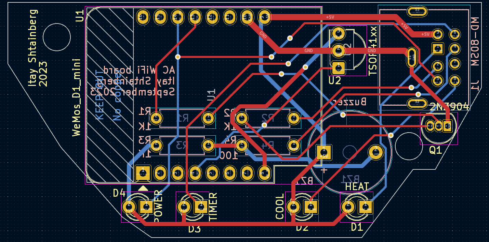
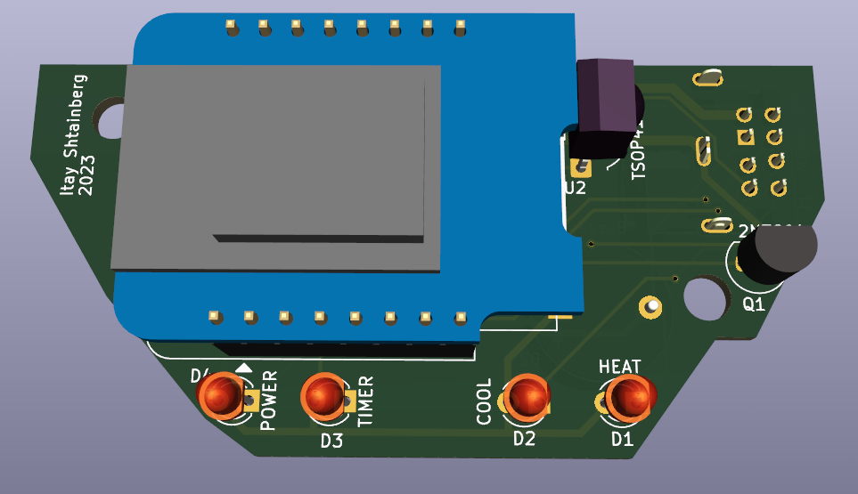
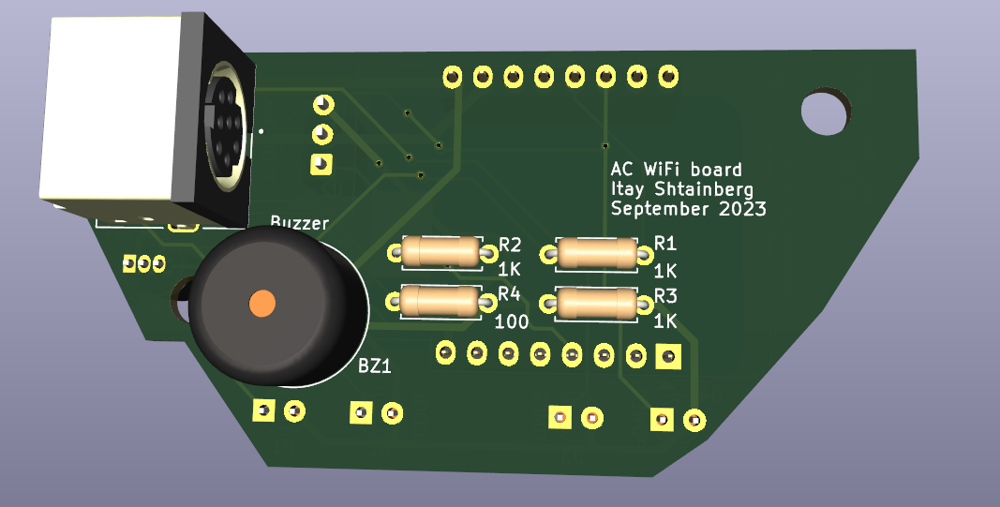

# ElectraWiFiBoard

A PCB which enables connecting an Electra air conditioner to internet using a Wemos D1 mini esp8266 module

The circuit is based on the [ElectraWiFi](https://github.com/giladger/ElectraWifi) repository by [giladger](https://github.com/giladger) which contains code for this project

I designed it using KiCad

# Bill of Materials
Connector - J1 - 8 pin DIN connector [footprint from CUI MD-80SM](https://www.cuidevices.com/product/interconnect/connectors/din-connectors/md-80sm)

WiFi Module - U1 - WeMos D1 mini

LED - D1-D4 - 3mm pth LED

IR Reciever - U2 - TSOP41xx

Buzzer - BZ1 - 12mm buzzer

Resistor - R4 - PTH resistor 100 ohm

Resistors - R1-R3 - PTH resistor 1K ohm

# Photos

# Credits

Thanks to Guy Eshel who prompted the design and helped with measurments 

Thanks to [giladger](https://github.com/giladger) and the contributors of the [ElectraWiFi](https://github.com/giladger/ElectraWifi) repo which contains the code for this project

